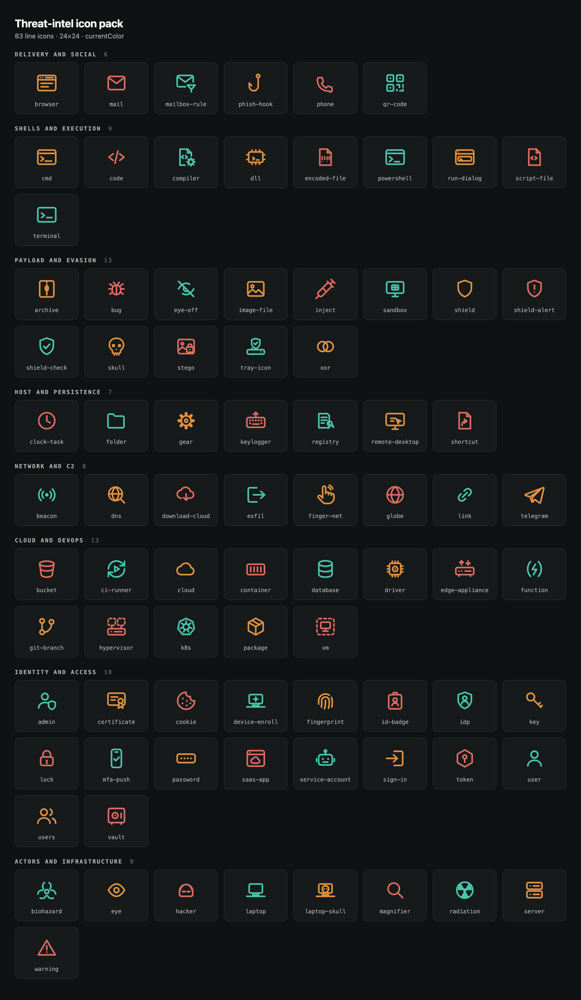
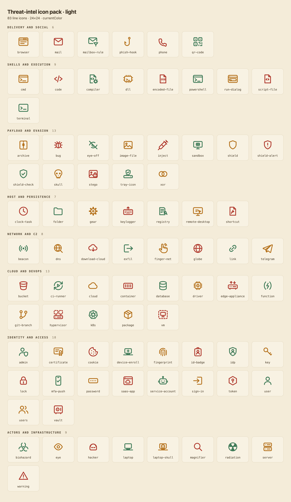

# Threat-intel icons

83 line icons for attack-chain diagrams, incident timelines and detection write-ups. General icon sets stop at "lock" and "server". This one draws the things intrusions are actually made of, like a run dialog, a scheduled task, process injection, a stego image, a beacon, an MFA push, a rogue CI runner and a kernel driver.



Every icon sits on a 24×24 grid with a 1.7 stroke, round caps and round joins. Strokes use `currentColor` and shapes are unfilled, so an icon takes whatever colour its container has and the same file works on dark and light grounds. Nothing is baked in, and composite icons are drawn with real gaps instead of background-coloured knockouts. A dashed outline means virtual, as in `vm` and the guests in `hypervisor`.



## Icons

| Category | Count | Names |
| --- | --- | --- |
| Delivery and social | 6 | `browser`, `mail`, `mailbox-rule`, `phish-hook`, `phone`, `qr-code` |
| Shells and execution | 9 | `cmd`, `code`, `compiler`, `dll`, `encoded-file`, `powershell`, `run-dialog`, `script-file`, `terminal` |
| Payload and evasion | 13 | `archive`, `bug`, `eye-off`, `image-file`, `inject`, `sandbox`, `shield`, `shield-alert`, `shield-check`, `skull`, `stego`, `tray-icon`, `xor` |
| Host and persistence | 7 | `clock-task`, `folder`, `gear`, `keylogger`, `registry`, `remote-desktop`, `shortcut` |
| Network and C2 | 8 | `beacon`, `dns`, `download-cloud`, `exfil`, `finger-net`, `globe`, `link`, `telegram` |
| Cloud and DevOps | 13 | `bucket`, `ci-runner`, `cloud`, `container`, `database`, `driver`, `edge-appliance`, `function`, `git-branch`, `hypervisor`, `k8s`, `package`, `vm` |
| Identity and access | 18 | `admin`, `certificate`, `cookie`, `device-enroll`, `fingerprint`, `id-badge`, `idp`, `key`, `lock`, `mfa-push`, `password`, `saas-app`, `service-account`, `sign-in`, `token`, `user`, `users`, `vault` |
| Actors and infrastructure | 9 | `biohazard`, `eye`, `hacker`, `laptop`, `laptop-skull`, `magnifier`, `radiation`, `server`, `warning` |

`icons/manifest.json` lists every name and `icons/categories.json` holds the grouping above.

## Use

Inline the SVG and set a colour on the wrapper.

```html
<span style="color:#e0913f">
  <!-- contents of icons/powershell.svg -->
</span>
```

In a browser, `icons.js` exposes the whole set plus a small helper.

```html
<script src="icons.js"></script>
<script>
  document.body.innerHTML += icon('beacon', {size: 48, stroke: 1.7});
</script>
```

## Add or change an icon

`make_icons.py` is the single source. Each icon is one string of inner SVG markup on the 24-grid, filed under a category. Add or edit an entry, then regenerate everything in one pass.

```bash
python3 make_icons.py icons --js icons.js --contact
```

That rewrites the SVGs, `manifest.json`, `categories.json`, `icons.js` and the contact-sheet HTML. Hand-editing a file in `icons/` gets overwritten on the next run, so make the change in the generator.

## License

MIT. See `LICENSE`.
